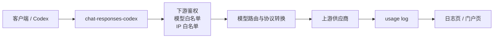
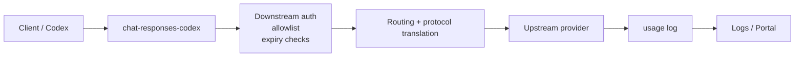

# chat-responses-codex

OpenAI-compatible gateway for Codex and other clients.  
面向 Codex 和其他客户端的 OpenAI 兼容网关。

`chat-responses-codex` sits between clients and upstream providers. It translates `chat.completions` and `responses` traffic, routes models across multiple providers, manages upstream and downstream keys, and exposes an admin console plus logs and portal views.  
`chat-responses-codex` 位于客户端与上游模型之间，负责 `chat.completions` 与 `responses` 协议转换、模型路由、上游/下游密钥管理，并提供管理后台、日志页和门户页。

Repositories:

- GitHub: [NewKavin/chat-responses-codex](https://github.com/NewKavin/chat-responses-codex)

## 中文

### 项目概览

这个项目的目标很简单：

- 客户端只连网关，不直连各家上游。
- 网关负责协议转换、模型路由和密钥管理。
- 管理员通过网页完成配置和排障。
- 使用日志和门户页面做运营观察，而不是把逻辑散落到客户端。

当前实现支持：

- `POST /v1/chat/completions`
- `POST /v1/responses`
- `GET /v1/models`
- Web 管理后台
- 自助门户
- 文件模式或 PostgreSQL 模式持久化

### 设计思路

1. 兼容优先
   - 对外保持 OpenAI 兼容 API。
   - 客户端只需要一个 `base_url` 和一个下游 Bearer Key。

2. 责任分层
   - 上游配置负责接入不同供应商。
   - 下游配置负责租户、白名单和访问控制。
   - 日志和门户负责可观测性。

3. 参考型配额
   - 上游配额字段保留为参考数据，用于路由偏置和运营观察。
   - 下游请求次数限额是实际拦截依据。
   - 当下游使用请求次数限额时，token 字段仍保留并展示为参考值，不参与实际拦截。

4. 部署可迁移
   - 本地开发可以用文件模式快速启动。
   - 正式环境建议使用 PostgreSQL。
   - Docker Compose 适合单实例生产或远端 VM 部署。

### 典型使用场景

- 给 Codex 提供统一的 OpenAI 兼容入口，后面挂多个模型供应商。
- 给团队/租户分配独立下游 Key、模型白名单和 IP 白名单。
- 在 Chat Completions 和 Responses 之间做协议转换和统一路由。
- 做内部模型池：同一个客户端配置，切换上游不需要改每个开发者的本地配置。
- 用日志页和门户页排查路由、延迟、失败和 token 形态。

### 仓库结构

- `src/`
  - 主网关服务、管理员后台、请求转发、协议转换。
- `crates/gateway-core/`
  - 共享的路由、状态、管理表单和数据结构。
- `crates/gateway-web/`
  - Leptos 风格的浏览器页面和演示 UI。
- `templates/`
  - Codex 与状态模板。
- `docs/`
  - 集成指南和设计说明。

### 本地部署

#### 方案 A: 文件模式，适合快速验证协议转换

这是最轻量的方式，适合先跑通“客户端 -> 网关 -> 上游”的链路。

```bash
cargo run
```

默认环境变量：

- `BIND_ADDR=0.0.0.0:3001`
- `STATE_PATH=data/state.json`
- `LOG_PATH=logs/chat-responses-codex.log`
- `ADMIN_USERNAME=admin`
- `ADMIN_PASSWORD=admin`
- `APP_NAME=chat-responses-codex`
- `MODEL_PROBE_REFRESH_INTERVAL_SECONDS=15`

启动后打开：

- `<gateway_origin>/admin`

建议按这个顺序操作：

1. 登录管理页。
2. 在 `Upstreams` 中配置一个或多个上游，填好 `base_url`、`api_key`、`protocol` 和 `supported_models`。
3. 在 `Downstreams` 中创建下游 Key。
4. 用下游 Key 作为客户端访问凭证。
5. 把客户端的 `base_url` 指向 `<gateway_origin>/v1`。
6. 先请求 `GET /v1/models`，再发一条真正的 `chat.completions` 或 `responses` 请求。

如果你只是想本地验证协议转换，这个模式已经足够。

#### 方案 B: PostgreSQL + Docker Compose，适合远端或正式部署

当前 Dockerfile 会在镜像构建时同时编译前端和后端，所以不需要在构建镜像前先手动生成 release 二进制。

```bash
cp .env.example .env
# 编辑 .env，至少设置 POSTGRES_PASSWORD 和 ADMIN_PASSWORD

docker compose up -d --build
```

启动后：

- 网关默认监听 `0.0.0.0:3001`
- PostgreSQL 使用 `postgres:15`
- 网关通过 `DATABASE_URL=postgres://chat_responses_codex@postgres/chat_responses_codex` 连接数据库

远端部署时建议这样做：

1. 在服务器上拉取代码。
2. 复制 `.env.example` 到 `.env`。
3. 设置强密码，尤其是 `POSTGRES_PASSWORD` 和 `ADMIN_PASSWORD`。
4. 直接执行 `docker compose up -d --build`。
5. 如需暴露到公网，前面再加一层反向代理和 TLS。

反向代理建议：

- 透传 `Authorization` 头。
- 透传 `X-Forwarded-For`，保证 IP 白名单可用。
- 只把网关暴露给可信网络，PostgreSQL 不要直接暴露公网。

当前运维约束：

- 单个 PostgreSQL 数据库只跑一个活跃网关实例。
- 目前不建议把多个网关副本同时挂到同一个数据库上。
- `STATE_PATH` 仅用于不设置 `DATABASE_URL` 的文件兼容模式。

### 协议转换思路



一句话：客户端只连网关，网关负责鉴权、路由、协议转换和日志记录。

### 配置说明

常用环境变量：

- `BIND_ADDR`：监听地址。
- `STATE_PATH`：文件模式状态文件路径。
- `DATABASE_URL`：PostgreSQL 连接串。设置后优先使用数据库模式。
- `LOG_PATH`：运行日志路径。
- `ADMIN_USERNAME` / `ADMIN_PASSWORD`：后台登录账号。
- `APP_NAME`：页面和日志中的应用名。
- `MODEL_PROBE_REFRESH_INTERVAL_SECONDS`：模型探测页自动刷新间隔，单位秒。
- `DASHBOARD_CACHE_TTL_SECONDS`：后端复用模型探测快照的缓存时间，单位秒。
- `USAGE_LOG_ROTATION_MAX_BYTES`：文件模式日志轮转阈值。
- `USAGE_LOG_ARCHIVE_MAX_FILES`：文件模式日志归档上限。
- `RUST_LOG`：可选，控制日志级别。
- `TZ`：可选，时区。

前者控制页面多久重新请求一次，后者控制后端多久重新探测一次。
两者刻意分开，避免把 UI 刷新节奏和上游探测成本绑死在一起。

配置原则：

- 上游配置负责“接哪些模型、发到哪、用什么协议发”。
- 下游配置负责“谁能用、能看到哪些模型、能跑多快、在哪些 IP 上能用”。
- 日志页和门户页负责“看见什么”和“排查什么”。

### 产品设计思路

这个项目不是单纯的反向代理，而是一个有状态的模型接入层。

- 兼容层：让 OpenAI-compatible 客户端无感接入。
- 路由层：按模型、协议、压力和可用性选择上游。
- 控制层：按下游 Key 做访问控制和配额控制。
- 观测层：把请求、状态码、耗时、token 和路由结果可视化。

这样设计的好处是：

- 客户端配置固定，不用为每个上游改一遍。
- 运维可以逐个接入/下线供应商。
- 业务方能看见真实请求形态，而不是只看黑盒错误。

### API 一览

- `POST /v1/chat/completions`
- `POST /v1/responses`
- `GET /v1/models`
- `GET /admin`
- `GET /admin/upstreams`
- `GET /admin/downstreams`
- `GET /admin/logs`
- `GET /portal`

### 客户端兼容矩阵

网关同时暴露以下协议端点：

| 协议族 | 端点 | 典型客户端 |
|--------|------|------------|
| Responses | `/v1/responses` | Codex |
| Chat Completions | `/v1/chat/completions` | Cline, OpenCode, 其他 OpenAI 兼容工具 |
| Messages | `/v1/messages` | Claude Code |

每个客户端只需要一个 `base_url` 和一个下游 Bearer Key：

- Codex → 门户集成页的 **Codex** preset（`config.toml` + `model-catalog.json` + `codex login`）
- Cline → 门户集成页的 **Cline / OpenAI 兼容** preset（`baseURL` + `apiKey` + `model`）
- OpenCode → 门户集成页的 **OpenCode** preset（`opencode.json`）
- Claude Code → 门户集成页的 **Claude Code** preset（`settings.json`）
- Anthropic 兼容客户端 → 门户集成页的 **Anthropic / Messages 兼容** preset（`baseURL` + `apiKey` + `model`）

### Codex 集成

如果你要把 Codex 接到本项目上，优先打开门户里的集成页：

- `<gateway_origin>/portal/integration`

页面会自动读取当前下游 key、当前网关 URL 和当前可用模型，并生成可直接复制的 Codex / OpenCode / Claude Code 配置。

如果你想看手工步骤，再看：

- [docs/codex-integration-guide.md](docs/codex-integration-guide.md)

那份指南已经把可替换项统一成了 `<gateway_origin>`、`<downstream_key>` 和 `<model_slug>`，按步骤替换即可。Codex 的 `model_catalog_json` 示例也已经做成了同目录相对路径，复制到 `~/.codex/` 后不需要再手工改路径。

### 开发

```bash
rtk cargo fmt --all
rtk cargo test --workspace
```

更多说明：

- [DEPLOYMENT.md](DEPLOYMENT.md)
- [docs/codex-integration-guide.md](docs/codex-integration-guide.md)
- [CONTRIBUTING.md](CONTRIBUTING.md)
- [SECURITY.md](SECURITY.md)

---

## English

### Overview

`chat-responses-codex` is an OpenAI-compatible gateway for Codex and other clients. It sits between clients and upstream providers, translates `chat.completions` and `responses` traffic, routes models across multiple providers, manages upstream and downstream keys, and exposes an admin console plus logs and portal views.

### Design Goals

1. Compatibility first
   - Keep an OpenAI-compatible API surface.
   - Clients only need a `base_url` and a downstream Bearer key.

2. Clear separation of concerns
   - Upstream settings describe how to reach providers.
   - Downstream settings describe tenants, allowlists, and access control.
   - Logs and portal pages provide observability.

3. Reference-oriented quotas
   - Upstream quota fields are kept as reference data for routing bias and operations.
   - Downstream request quotas are enforced by the gateway.
   - When a downstream uses request quotas, token fields are still persisted and displayed as reference data, but they do not participate in enforcement.

4. Portable deployment
   - File-backed mode is useful for local development.
   - PostgreSQL is the preferred production-like mode.
   - Docker Compose is a practical fit for a single remote VM or a small self-hosted setup.

### Typical Use Cases

- Give Codex one stable OpenAI-compatible endpoint while the gateway fans out to several model providers.
- Isolate teams or tenants with per-key allowlists, model filters, and IP restrictions.
- Translate between Chat Completions and Responses protocols.
- Share one internal model gateway across many developers without making them reconfigure every provider.
- Use logs and portal pages to inspect routing, latency, failures, and token shapes.

### Repository Layout

- `src/`
  - Main gateway service, admin console, request dispatch, and protocol conversion.
- `crates/gateway-core/`
  - Shared state, routing, admin form types, and domain models.
- `crates/gateway-web/`
  - Leptos-based browser pages and demo UI.
- `templates/`
  - Codex and state templates.
- `docs/`
  - Integration guide and design notes.

### Local Deployment

#### Option A: File-backed mode for quick protocol conversion tests

```bash
cargo run
```

Default environment:

- `BIND_ADDR=0.0.0.0:3001`
- `STATE_PATH=data/state.json`
- `LOG_PATH=logs/chat-responses-codex.log`
- `ADMIN_USERNAME=admin`
- `ADMIN_PASSWORD=admin`
- `APP_NAME=chat-responses-codex`

Open:

- `<gateway_origin>/admin`

Recommended bootstrap sequence:

1. Log in to the admin UI.
2. Configure one or more upstreams with `base_url`, `api_key`, `protocol`, and `supported_models`.
3. Create a downstream key.
4. Use that downstream key as the client credential.
5. Point the client `base_url` to `<gateway_origin>/v1`.
6. Test `GET /v1/models`, then send a real `chat.completions` or `responses` request.

This mode is enough if you only want to verify protocol conversion locally.

#### Option B: PostgreSQL + Docker Compose for remote or production-like deployments

The current Dockerfile builds both the frontend and backend inside the image, so you do not need to build the release binary first.

```bash
cp .env.example .env
# Edit .env and set at least POSTGRES_PASSWORD and ADMIN_PASSWORD

docker compose up -d --build
```

Deployment notes:

- The gateway listens on `0.0.0.0:3001` by default.
- PostgreSQL runs as `postgres:15`.
- The gateway connects with `DATABASE_URL=postgres://chat_responses_codex@postgres/chat_responses_codex`.

For a remote host:

1. Clone the repository on the server.
2. Copy `.env.example` to `.env`.
3. Set strong passwords, especially `POSTGRES_PASSWORD` and `ADMIN_PASSWORD`.
4. Run `docker compose up -d --build`.
5. Put a reverse proxy and TLS in front if you expose the service publicly.

Reverse proxy guidance:

- Forward `Authorization`.
- Forward `X-Forwarded-For` so IP allowlists keep working.
- Keep PostgreSQL off the public internet.

Operational constraint:

- Run only one active gateway instance per PostgreSQL database.
- Do not run multiple active replicas against the same database yet.
- Use `STATE_PATH` only when `DATABASE_URL` is unset and you want file-backed compatibility mode.

### How Protocol Conversion Works



In one line: the client talks only to the gateway, and the gateway handles auth, routing, translation, and logging.

### Configuration

Common environment variables:

- `BIND_ADDR`: listen address.
- `STATE_PATH`: file-backed state path.
- `DATABASE_URL`: PostgreSQL connection string. When set, the database-backed mode is used.
- `LOG_PATH`: runtime log path.
- `ADMIN_USERNAME` / `ADMIN_PASSWORD`: admin login.
- `APP_NAME`: application name shown in the UI and logs.
- `USAGE_LOG_ROTATION_MAX_BYTES`: file-backed log rotation threshold.
- `USAGE_LOG_ARCHIVE_MAX_FILES`: maximum number of log archive files.
- `RUST_LOG`: optional log level filter.
- `TZ`: optional timezone.

Configuration model:

- Upstream settings define which models are reachable and how to call them.
- Downstream settings define who can use the gateway, what they can see, and how fast they can go.
- Logs and portal pages define what operators can observe.

### Product Design

This project is not just a reverse proxy. It is a stateful model access layer.

- Compatibility layer: clients stay on a stable OpenAI-compatible interface.
- Routing layer: model support, protocol, and runtime pressure drive upstream selection.
- Control layer: downstream keys, allowlists, and quotas control access.
- Observability layer: request IDs, status codes, latency, and token shapes are visible in the UI.

That design keeps client configuration stable, allows providers to be added or removed independently, and gives operators a clear view of real request behavior.

### API

- `POST /v1/chat/completions`
- `POST /v1/responses`
- `GET /v1/models`
- `GET /admin`
- `GET /admin/upstreams`
- `GET /admin/downstreams`
- `GET /admin/logs`
- `GET /portal`

### Client Compatibility Matrix

The gateway exposes these protocol endpoints simultaneously:

| Protocol family | Endpoint | Typical clients |
|-----------------|----------|-----------------|
| Responses | `/v1/responses` | Codex |
| Chat Completions | `/v1/chat/completions` | Cline, OpenCode, other OpenAI-compatible tools |
| Messages | `/v1/messages` | Claude Code |

Each client only needs a `base_url` and a downstream Bearer key:

- Codex → portal integration page **Codex** preset (`config.toml` + `model-catalog.json` + `codex login`)
- Cline → portal integration page **Cline / OpenAI-compatible** preset (`baseURL` + `apiKey` + `model`)
- OpenCode → portal integration page **OpenCode** preset (`opencode.json`)
- Claude Code → portal integration page **Claude Code** preset (`settings.json`)
- Anthropic-compatible clients → portal integration page **Anthropic / Messages-compatible** preset (`baseURL` + `apiKey` + `model`)

### Codex Integration

The full integration guide lives here:

- [docs/codex-integration-guide.md](docs/codex-integration-guide.md)

That guide uses one placeholder set: `<gateway_origin>`, `<downstream_key>`, and `<model_slug>`. Replace those values and follow the steps.

### Development

```bash
rtk cargo fmt --all
rtk cargo test --workspace
```

Additional docs:

- [DEPLOYMENT.md](DEPLOYMENT.md)
- [docs/codex-integration-guide.md](docs/codex-integration-guide.md)
- [CONTRIBUTING.md](CONTRIBUTING.md)
- [SECURITY.md](SECURITY.md)

## License

Licensed under the GNU Affero General Public License v3.0 or later. See [LICENSE](LICENSE).
