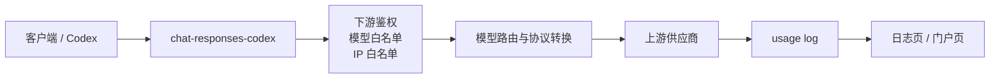
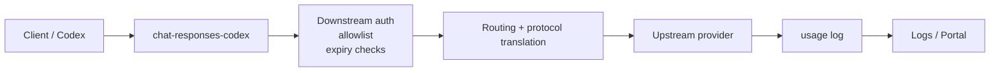

# chat-responses-codex

OpenAI-compatible gateway for Codex and other clients.  
面向 Codex 和其他客户端的 OpenAI 兼容网关。

`chat-responses-codex` sits between clients and upstream providers. It translates `chat.completions` and `responses` traffic, routes models across multiple providers, manages upstream and downstream keys, and exposes an admin console plus logs and portal views.  
`chat-responses-codex` 位于客户端与上游模型之间，负责 `chat.completions` 与 `responses` 协议转换、模型路由、上游/下游密钥管理，并提供管理后台、日志页和门户页。

Repositories:

- GitHub: [NewKavin/chat-responses-codex](https://github.com/NewKavin/chat-responses-codex)

## 中文

### 项目概览

这个项目的目标很简单：

- 客户端只连网关，不直连各家上游。
- 网关负责协议转换、模型路由和密钥管理。
- 管理员通过网页完成配置和排障。
- 使用日志和门户页面做运营观察，而不是把逻辑散落到客户端。

当前实现支持：

- `POST /v1/chat/completions`
- `POST /v1/responses`
- `GET /v1/models`
- Web 管理后台
- 自助门户
- 文件模式或 PostgreSQL 模式持久化

### 设计思路

1. 兼容优先
   - 对外保持 OpenAI 兼容 API。
   - 客户端只需要一个 `base_url` 和一个下游 Bearer Key。

2. 责任分层
   - 上游配置负责接入不同供应商。
   - 下游配置负责租户、白名单和访问控制。
   - 日志和门户负责可观测性。

3. 参考型配额
   - 上游配额字段保留为参考数据，用于路由偏置和运营观察。
   - 下游请求次数限额是实际拦截依据。
   - 当下游使用请求次数限额时，token 字段仍保留并展示为参考值，不参与实际拦截。

4. 部署可迁移
   - 本地开发可以用文件模式快速启动。
   - 正式环境建议使用 PostgreSQL。
   - Docker Compose 适合单实例生产或远端 VM 部署。

### 典型使用场景

- 给 Codex 提供统一的 OpenAI 兼容入口，后面挂多个模型供应商。
- 给团队/租户分配独立下游 Key、模型白名单和 IP 白名单。
- 在 Chat Completions 和 Responses 之间做协议转换和统一路由。
- 做内部模型池：同一个客户端配置，切换上游不需要改每个开发者的本地配置。
- 用日志页和门户页排查路由、延迟、失败和 token 形态。

### 仓库结构

- `src/`
  - 主网关服务、管理员后台、请求转发、协议转换。
- `crates/gateway-core/`
  - 共享的路由、状态、管理表单和数据结构。
- `crates/gateway-web/`
  - Leptos 风格的浏览器页面和演示 UI。
- `templates/`
  - Codex 与状态模板。
- `docs/`
  - 集成指南和设计说明。

### 本地部署

#### 方案 A: 文件模式，适合快速验证协议转换

这是最轻量的方式，适合先跑通“客户端 -> 网关 -> 上游”的链路。

```bash
cargo run
```

文件模式常用启动环境变量：

- `BIND_ADDR=0.0.0.0:3001`
- `STATE_PATH=data/state.json`
- `LOG_PATH=logs/chat-responses-codex.log`
- `RUST_LOG=info`
- `ADMIN_USERNAME=admin`
- `ADMIN_PASSWORD=admin`

应用名称、探测、路由、并发、HTTP 和日志保留等行为参数在启动后通过
`Admin > Settings` 配置。

启动后打开：

- `<gateway_origin>/admin`

建议按这个顺序操作：

1. 登录管理页。
2. 在 `Upstreams` 中配置一个或多个上游，填好 `base_url`、`api_key`、`protocol` 和 `supported_models`。
3. 在 `Downstreams` 中创建下游 Key。
4. 用下游 Key 作为客户端访问凭证。
5. 把客户端的 `base_url` 指向 `<gateway_origin>/v1`。
6. 先请求 `GET /v1/models`，再发一条真正的 `chat.completions` 或 `responses` 请求。

如果你只是想本地验证协议转换，这个模式已经足够。

#### 方案 B: PostgreSQL + Docker Compose，适合远端或正式部署

当前 Dockerfile 会在镜像构建时同时编译前端和后端，所以不需要在构建镜像前先手动生成 release 二进制。

```bash
cp .env.example .env
# 编辑 .env，至少设置 POSTGRES_PASSWORD 和 ADMIN_PASSWORD

docker compose up -d --build
```

默认命令保持 `REDIS_ENABLED=false`，适合单个权威网关实例。需要多个网关副本时，先在 `.env` 中设置 `REDIS_ENABLED=true` 和部署专用的 `REDIS_KEY_PREFIX`，再启动可选 profile：

```bash
docker compose --profile redis up -d --build
```

该命令启动 Redis 和一个 gateway；额外副本需要通过 Compose override 或其他编排器另行配置，并为每个副本使用不冲突的容器名和 host port。

Redis 只协调运行时准入、租约和精确路由健康；PostgreSQL 仍是上游、下游、能力配置和 usage log 的持久化权威。Redis does not replace PostgreSQL。启用 Redis 时，启动阶段连接失败会 fail fast；运行中 Redis 不可用会 fail closed，以 503 拒绝依赖协调状态的请求，不会静默退回各实例的本地计数。日志不会输出 `REDIS_URL` 或凭据，同一 Redis 上的每个部署必须使用不同的 `REDIS_KEY_PREFIX`。

启动后：

- 网关默认监听 `0.0.0.0:3001`
- PostgreSQL 使用 `postgres:15`
- 网关通过 `DATABASE_URL=postgres://chat_responses_codex@postgres/chat_responses_codex` 连接数据库

远端部署时建议这样做：

1. 在服务器上拉取代码。
2. 复制 `.env.example` 到 `.env`。
3. 设置强密码，尤其是 `POSTGRES_PASSWORD` 和 `ADMIN_PASSWORD`。
4. 直接执行 `docker compose up -d --build`。
5. 如需暴露到公网，前面再加一层反向代理和 TLS。

反向代理建议：

- 透传 `Authorization` 头。
- 透传 `X-Forwarded-For`，保证 IP 白名单可用。
- 只把网关暴露给可信网络，PostgreSQL 不要直接暴露公网。

当前运维约束：

- `REDIS_ENABLED=false` 时，单个 PostgreSQL 数据库只跑一个权威网关实例。
- `REDIS_ENABLED=true` 时，多个副本通过 Redis 共享准入限制、租约、冷却和半开状态。
- Redis 模式仍要求所有副本连接同一个 PostgreSQL 数据库，并使用相同且部署隔离的 `REDIS_KEY_PREFIX`。
- `STATE_PATH` 仅用于不设置 `DATABASE_URL` 的文件兼容模式。

### 协议转换思路


```mermaid
flowchart LR
    A[客户端 / Codex] --> B[chat-responses-codex]
    B --> C[下游鉴权\n模型白名单\nIP 白名单]
    C --> D[模型路由与协议转换]
    D --> E[上游供应商]
    E --> F[usage log]
    F --> G[日志页 / 门户页]
```

一句话：客户端只连网关，网关负责鉴权、路由、协议转换和日志记录。

### 配置说明

Saved values from Admin > Settings override legacy behavior environment variables.
Existing variables are used only until the first settings save. Bootstrap
connections and credentials remain environment-only.

也就是说，升级后的旧部署在第一次保存设置前仍读取原有行为环境变量；第一次保存会把完整设置文档持久化，之后以保存值为准，不再混用环境变量。保存不会改写现有 `.env` 文件。

`.env` 只负责这些启动边界：

- `BIND_ADDR`、`STATE_PATH`、`DATABASE_URL`：监听地址与持久化连接。
- `POSTGRES_PASSWORD`、`POSTGRES_POOL_MAX_SIZE`：数据库凭据与连接池。
- `ADMIN_USERNAME`、`ADMIN_PASSWORD`、`JWT_SECRET`：管理端身份与签名密钥。
- `LOG_PATH`、`RUST_LOG`、`TZ`：进程日志与时区。
- `REDIS_ENABLED`、`REDIS_URL`、`REDIS_KEY_PREFIX`：可选多副本协调。
- `UPSTREAM_CA_CERT_PATH`：内部 CA 信任路径。
- `CAPABILITY_POLICY_BOOTSTRAP_ON_ZERO`：仅用于 revision 0 的能力策略引导。

应用名称、模型发现、能力探测、路由、并发、HTTP 和日志保留统一在
`/admin/settings` 中编辑。页面会区分“即时生效”和“重启后生效”：即时字段只影响保存之后开始的新请求，重启字段会显示待重启状态。凭据、连接串和 CA 路径不会进入该页面。

旧部署建议先升级并登录 `Admin > Settings` 核对由现有环境变量生成的值，保存一次后再从自有 `.env` 中删除旧行为变量。Compose 不再透传行为环境变量，应用行为统一在 `/admin/settings` 中维护。

### 多 Key 精确路由与故障语义

一个上游账号可以配置多个 Key，每个 Key 的模型集合分别持久化并参与精确路由。一次成功发现得到的空集合是权威空映射，表示该 Key 当前不支持任何模型；它不会回退到账号级模型列表。缺少持久模型映射的旧部署需要先执行一次成功的“获取模型”，或者让后台旧数据发现完整成功一次，之后 `/v1/models` 才会发布这些模型。

`/v1/models` 只读取持久化模型目录，不读取运行时健康状态。精确路由健康状态只保存在当前进程：重启会清空冷却/半开记录并以 fail-open 方式重新尝试，但不会新增或删除目录模型。因此，共享同一数据库时只支持一个活跃网关实例。

请求失败时使用有界切路：开启“同路由重试”时，普通上游 5xx 在同一精确路由最多重试一次；关闭后直接进入下一 Key/upstream 候选。Transport/5xx 精确路由冷却按设置页中的初始值指数增长，并受冷却上限约束。429 保存上游完整的 `Retry-After`、冷却该路由并立即尝试下一条候选路由。明确识别为上游并发已满、但没有 `Retry-After` 的 429 使用设置页中的并发探测延迟序列，同一路由同一时刻只允许一个半开探测。全部候选路由都因临时故障耗尽后，只有最早恢复时间（含不超过 100 毫秒的抖动）能放进剩余等待预算时才开始新一轮，且绝不会早于供应商的 `Retry-After`。否则网关使用健康注册表中的实时最早恢复时间作为终态 `Retry-After`：纯上游限流、并发饱和或 Key 配额耗尽返回 429，混合了 5xx、网络错误或普通容量不足时仍返回 503。安全错误文案会列出失败原因、路由数量和已消耗的网关重试时间。自动重放只发生在首个可用输出交付之前，并复用同一个幂等标识；如果供应商不支持该幂等头，交付语义仍是 at-least-once，可能产生重复推理或供应商侧存储。

Setting the route-exhaustion wait budget to `0` means zero disables waiting, and total rounds include the initial round. The gateway preserves the full `Retry-After`; configured priority cannot make an unhealthy route eligible; output or tool calls are never replayed after delivery.

稳定客户端结果：

| HTTP / code | 含义 |
|-------------|------|
| 429 `upstream_routes_exhausted` | 所有候选均为上游限流、并发饱和或 Key 配额耗尽；错误类型为 `rate_limit_error`，客户端按 `Retry-After` 重试 |
| 503 `upstream_routes_exhausted` | 临时耗尽中混有 5xx、网络错误或普通容量不足；客户端按 `Retry-After` 重试 |
| 502 `upstream_credentials_exhausted` | 所有候选 Key 均发生凭证、余额或计费失败 |
| 502 `upstream_model_unsupported` | 所有已尝试路由均拒绝该模型 |
| 400 `capability_not_supported` | 没有路由能保留客户端明确要求的能力 |
| 502 `upstream_protocol_unsupported` | 没有路由支持请求端点或协议 |

配置原则：

- 上游配置负责“接哪些模型、发到哪、用什么协议发”。
- 下游配置负责“谁能用、能看到哪些模型、能跑多快、在哪些 IP 上能用”。
- 日志页和门户页负责“看见什么”和“排查什么”。

### 产品设计思路

这个项目不是单纯的反向代理，而是一个有状态的模型接入层。

- 兼容层：让 OpenAI-compatible 客户端无感接入。
- 路由层：按模型、协议、压力和可用性选择上游。
- 控制层：按下游 Key 做访问控制和配额控制。
- 观测层：把请求、状态码、耗时、token 和路由结果可视化。

这样设计的好处是：

- 客户端配置固定，不用为每个上游改一遍。
- 运维可以逐个接入/下线供应商。
- 业务方能看见真实请求形态，而不是只看黑盒错误。

### API 一览

- `POST /v1/chat/completions`
- `POST /v1/responses`
- `GET /v1/models`
- `GET /admin`
- `GET /admin/upstreams`
- `GET /admin/downstreams`
- `GET /admin/logs`
- `GET /portal`

### 客户端兼容矩阵

网关同时暴露以下协议端点：

| 协议族 | 端点 | 典型客户端 |
|--------|------|------------|
| Responses | `/v1/responses` | Codex |
| Chat Completions | `/v1/chat/completions` | Cline, OpenCode, 其他 OpenAI 兼容工具 |
| Messages | `/v1/messages` | Claude Code |

每个客户端只需要一个 `base_url` 和一个下游 Bearer Key：

- Codex → 门户集成页的 **Codex** preset（`config.toml` + `model-catalog.json` + `codex login`）
- Cline → 门户集成页的 **Cline / OpenAI 兼容** preset（`baseURL` + `apiKey` + `model`）
- OpenCode → 门户集成页的 **OpenCode** preset（`opencode.json`）
- Claude Code → 门户集成页的 **Claude Code** preset（`settings.json`）
- Hermes → `templates/hermes/config.yaml`（Chat Completions）
- Anthropic 兼容客户端 → 门户集成页的 **Anthropic / Messages 兼容** preset（`baseURL` + `apiKey` + `model`）

协议兼容由外部 capability policy 和精确路由 probe 驱动，不按模型名、厂商名或 hostname 写死。第三方和自部署 API 是主要目标：语义 policy 描述模型约束，probe profile 证明某个 upstream/runtime slug/protocol 的实际 wire 能力。网关按 `preserve -> adapt -> bounded downgrade -> reject` 处理请求，不支持的必需能力会在上游调度前失败。

管理端的排障中心支持 capability JSON 导入/导出、精确 profile 查看、手动 probe，以及 Codex/OpenCode/Claude Code/Hermes 四客户端语义矩阵。详见：

- [协议兼容与成熟度](docs/PROTOCOL_COMPATIBILITY.md)
- [可替换 capability 模板](templates/capabilities/current-deployment.example.json)
- [部署和验收](DEPLOYMENT.md)

### Codex 集成

如果你要把 Codex 接到本项目上，优先打开门户里的集成页：

- `<gateway_origin>/portal/integration`

页面会自动读取当前下游 key、当前网关 URL 和当前可用模型，并生成可直接复制的 Codex / OpenCode / Claude Code 配置。

如果你想看手工步骤，再看：

- [docs/codex-integration-guide.md](docs/codex-integration-guide.md)
- [docs/PROTOCOL_COMPATIBILITY.md](docs/PROTOCOL_COMPATIBILITY.md)

那份指南已经把可替换项统一成了 `<gateway_origin>`、`<downstream_key>`、`<model_slug>` 和 live catalog 中的推理等级，按步骤替换即可。Codex 的 `model_catalog_json` 示例也已经做成了同目录相对路径，复制到 `~/.codex/` 后不需要再手工改路径。

当前示例按 Codex CLI `0.146.0` 验证，并默认启用 `multi_agent`。调整 `[agents]` 下的 `max_threads` 可以增加并发代理线程数，`max_depth` 用于限制嵌套委派深度；这些客户端设置不会覆盖网关配额。主配置和 `~/.codex/agents/default.toml` 必须使用同一 live catalog 条目的 `model` 和 `model_reasoning_effort`，然后运行 `codex login --with-api-key` 写入下游 key，并用 `codex --strict-config doctor --summary` 检查配置是否实际生效。

### 开发

```bash
rtk cargo fmt --all
rtk cargo test --workspace
```

更多说明：

- [DEPLOYMENT.md](DEPLOYMENT.md)
- [docs/codex-integration-guide.md](docs/codex-integration-guide.md)
- [CONTRIBUTING.md](CONTRIBUTING.md)
- [SECURITY.md](SECURITY.md)

---

## English

### Overview

`chat-responses-codex` is an OpenAI-compatible gateway for Codex and other clients. It sits between clients and upstream providers, translates `chat.completions` and `responses` traffic, routes models across multiple providers, manages upstream and downstream keys, and exposes an admin console plus logs and portal views.

### Design Goals

1. Compatibility first
   - Keep an OpenAI-compatible API surface.
   - Clients only need a `base_url` and a downstream Bearer key.

2. Clear separation of concerns
   - Upstream settings describe how to reach providers.
   - Downstream settings describe tenants, allowlists, and access control.
   - Logs and portal pages provide observability.

3. Reference-oriented quotas
   - Upstream quota fields are kept as reference data for routing bias and operations.
   - Downstream request quotas are enforced by the gateway.
   - When a downstream uses request quotas, token fields are still persisted and displayed as reference data, but they do not participate in enforcement.

4. Portable deployment
   - File-backed mode is useful for local development.
   - PostgreSQL is the preferred production-like mode.
   - Docker Compose is a practical fit for a single remote VM or a small self-hosted setup.

### Typical Use Cases

- Give Codex one stable OpenAI-compatible endpoint while the gateway fans out to several model providers.
- Isolate teams or tenants with per-key allowlists, model filters, and IP restrictions.
- Translate between Chat Completions and Responses protocols.
- Share one internal model gateway across many developers without making them reconfigure every provider.
- Use logs and portal pages to inspect routing, latency, failures, and token shapes.

### Repository Layout

- `src/`
  - Main gateway service, admin console, request dispatch, and protocol conversion.
- `crates/gateway-core/`
  - Shared state, routing, admin form types, and domain models.
- `crates/gateway-web/`
  - Leptos-based browser pages and demo UI.
- `templates/`
  - Codex and state templates.
- `docs/`
  - Integration guide and design notes.

### Local Deployment

#### Option A: File-backed mode for quick protocol conversion tests

```bash
cargo run
```

Default environment:

- `BIND_ADDR=0.0.0.0:3001`
- `STATE_PATH=data/state.json`
- `LOG_PATH=logs/chat-responses-codex.log`
- `RUST_LOG=info`
- `ADMIN_USERNAME=admin`
- `ADMIN_PASSWORD=admin`

Application identity, discovery, probes, routing, concurrency, HTTP, and log
retention are configured after startup under `Admin > Settings`.

Open:

- `<gateway_origin>/admin`

Recommended bootstrap sequence:

1. Log in to the admin UI.
2. Configure one or more upstreams with `base_url`, `api_key`, `protocol`, and `supported_models`.
3. Create a downstream key.
4. Use that downstream key as the client credential.
5. Point the client `base_url` to `<gateway_origin>/v1`.
6. Test `GET /v1/models`, then send a real `chat.completions` or `responses` request.

This mode is enough if you only want to verify protocol conversion locally.

#### Option B: PostgreSQL + Docker Compose for remote or production-like deployments

The current Dockerfile builds both the frontend and backend inside the image, so you do not need to build the release binary first.

```bash
cp .env.example .env
# Edit .env and set at least POSTGRES_PASSWORD and ADMIN_PASSWORD

docker compose up -d --build
```

The default command keeps `REDIS_ENABLED=false` and supports one authoritative
gateway instance. To coordinate multiple gateway replicas, set
`REDIS_ENABLED=true` and a deployment-specific `REDIS_KEY_PREFIX` in `.env`,
then start the optional profile:

```bash
docker compose --profile redis up -d --build
```

This command starts Redis and one gateway. Provision additional gateway
replicas through a Compose override or another orchestrator, with unique
container names and non-conflicting host ports.

Redis coordinates runtime admission, leases, and exact-route health only.
Redis does not replace PostgreSQL, which remains authoritative for durable
configuration and usage logs. Enabled deployments fail fast when Redis cannot
be initialized and fail closed with 503 responses if Redis becomes unavailable
at runtime; they never fall back silently to per-process counters. Redis URLs
and credentials are not logged. Use a distinct `REDIS_KEY_PREFIX` for every
deployment sharing a Redis service.

Deployment notes:

- The gateway listens on `0.0.0.0:3001` by default.
- PostgreSQL runs as `postgres:15`.
- The gateway connects with `DATABASE_URL=postgres://chat_responses_codex@postgres/chat_responses_codex`.

For a remote host:

1. Clone the repository on the server.
2. Copy `.env.example` to `.env`.
3. Set strong passwords, especially `POSTGRES_PASSWORD` and `ADMIN_PASSWORD`.
4. Run `docker compose up -d --build`.
5. Put a reverse proxy and TLS in front if you expose the service publicly.

Reverse proxy guidance:

- Forward `Authorization`.
- Forward `X-Forwarded-For` so IP allowlists keep working.
- Keep PostgreSQL off the public internet.

Operational constraint:

- With `REDIS_ENABLED=false`, run one authoritative gateway instance per PostgreSQL database.
- With `REDIS_ENABLED=true`, replicas share admission windows, leases, cooldowns, and half-open ownership through Redis.
- Redis-coordinated replicas still use the same PostgreSQL database and a shared, deployment-isolated `REDIS_KEY_PREFIX`.
- Use `STATE_PATH` only when `DATABASE_URL` is unset and you want file-backed compatibility mode.

### How Protocol Conversion Works


```mermaid
flowchart LR
    A[Client / Codex] --> B[chat-responses-codex]
    B --> C[Downstream auth\nallowlist\nexpiry checks]
    C --> D[Routing + protocol translation]
    D --> E[Upstream provider]
    E --> F[usage log]
    F --> G[Logs / Portal]
```

In one line: the client talks only to the gateway, and the gateway handles auth, routing, translation, and logging.

### Configuration

Saved values from Admin > Settings override legacy behavior environment variables.
Existing variables are used only until the first settings save. Bootstrap
connections and credentials remain environment-only.

Environment configuration is limited to process bootstrap and infrastructure:

- `BIND_ADDR`, `STATE_PATH`, and `DATABASE_URL` select the listener and durable store.
- `POSTGRES_PASSWORD` and `POSTGRES_POOL_MAX_SIZE` configure database access.
- `ADMIN_USERNAME`, `ADMIN_PASSWORD`, and `JWT_SECRET` secure the admin session.
- `LOG_PATH`, `RUST_LOG`, and `TZ` configure process logging and time.
- `REDIS_ENABLED`, `REDIS_URL`, and `REDIS_KEY_PREFIX` enable optional replica coordination.
- `UPSTREAM_CA_CERT_PATH` adds internal CA trust.
- `CAPABILITY_POLICY_BOOTSTRAP_ON_ZERO` controls only the revision-zero policy bootstrap.

Use `/admin/settings` for application identity, discovery, probes, routing,
concurrency, HTTP, and log retention. The page distinguishes settings applied
to newly started requests immediately from settings that require a gateway
restart. Connections, credentials, and CA paths are intentionally absent.

On upgrade, review the effective values in `Admin > Settings` before saving.
The first save persists the complete settings document; later starts use that
document instead of legacy behavior variables, and the gateway never rewrites
an operator's `.env`. Compose no longer passes through behavior environment variables;
`docker-compose.yml` wires bootstrap and credentials only, and all behavior
settings are maintained in `Admin > Settings`.

Configuration model:

- Upstream settings define which models are reachable and how to call them.
- Downstream settings define who can use the gateway, what they can see, and how fast they can go.
- Logs and portal pages define what operators can observe.

### Multi-Key Route Resilience

Each key under one upstream account has its own persisted model mapping and is scheduled as an exact route. A successful discovery that returns no models is an authoritative empty mapping: that key supports no models and does not inherit the account-level list. As an upgrade step, a deployment with empty persisted `supported_models` must complete one explicit discovery, or one full background legacy discovery, before `/v1/models` advertises those models. The endpoint reads only the persisted model catalog.

Runtime failures never rewrite capability data. When same-route retry is enabled in Admin Settings, a generic upstream 5xx retries the same exact route once before moving on; disabling it preserves the initial key/upstream fallback. Transport/5xx exact-route cooldown grows from the configured base and is capped by the configured maximum. An upstream 429 stores the full `Retry-After` as route cooldown and switches immediately to another eligible route. A concurrency-specific 429 without `Retry-After` uses the configured probe-delay sequence, with one half-open probe per exact route at a time. After temporary all-route exhaustion, the gateway starts a fresh round only when the earliest exact-route recovery plus jitter fits the remaining logical-request wait budget; it never probes before provider recovery. A terminal response uses the health registry's live earliest recovery for `Retry-After`: pure upstream rate-limit, concurrency, or key-quota exhaustion returns 429, while any mixed 5xx, transport, or generic capacity failure remains 503. The safe message includes cause counts and gateway retry time. Automatic replay before usable output reuses the same idempotency identifier, but delivery remains at-least-once when a provider ignores or does not support the idempotency header; duplicate inference or provider-side storage is still possible.

Setting the route-exhaustion wait budget to `0` means zero disables waiting, and total rounds include the initial round. The gateway preserves the full `Retry-After`; configured priority cannot make an unhealthy route eligible; output or tool calls are never replayed after delivery.

Exact route health is process-local; run one active gateway instance per database. The runtime route health resets on restart and fails open on the next request. It does not change the persisted model catalog, so restart and temporary provider failures do not add or remove models from `/v1/models`.

Stable client outcomes:

| HTTP / code | Meaning |
|-------------|---------|
| 429 `upstream_routes_exhausted` | Every route is upstream rate-limited, concurrency-saturated, or key-quota exhausted; type is `rate_limit_error` |
| 503 `upstream_routes_exhausted` | Temporary exhaustion includes a 5xx, transport, or generic capacity failure |
| 502 `upstream_credentials_exhausted` | Every eligible key failed credentials, balance, or billing checks |
| 502 `upstream_model_unsupported` | Every attempted route rejected the requested model |
| 400 `capability_not_supported` | No route can preserve an explicitly required capability |
| 502 `upstream_protocol_unsupported` | No route supports the requested endpoint or protocol |

### Product Design

This project is not just a reverse proxy. It is a stateful model access layer.

- Compatibility layer: clients stay on a stable OpenAI-compatible interface.
- Routing layer: model support, protocol, and runtime pressure drive upstream selection.
- Control layer: downstream keys, allowlists, and quotas control access.
- Observability layer: request IDs, status codes, latency, and token shapes are visible in the UI.

That design keeps client configuration stable, allows providers to be added or removed independently, and gives operators a clear view of real request behavior.

### API

- `POST /v1/chat/completions`
- `POST /v1/responses`
- `GET /v1/models`
- `GET /admin`
- `GET /admin/upstreams`
- `GET /admin/downstreams`
- `GET /admin/logs`
- `GET /portal`

### Client Compatibility Matrix

The gateway exposes these protocol endpoints simultaneously:

| Protocol family | Endpoint | Typical clients |
|-----------------|----------|-----------------|
| Responses | `/v1/responses` | Codex |
| Chat Completions | `/v1/chat/completions` | Cline, OpenCode, other OpenAI-compatible tools |
| Messages | `/v1/messages` | Claude Code |

Each client only needs a `base_url` and a downstream Bearer key:

- Codex → portal integration page **Codex** preset (`config.toml` + `model-catalog.json` + `codex login`)
- Cline → portal integration page **Cline / OpenAI-compatible** preset (`baseURL` + `apiKey` + `model`)
- OpenCode → portal integration page **OpenCode** preset (`opencode.json`)
- Claude Code → portal integration page **Claude Code** preset (`settings.json`)
- Anthropic-compatible clients → portal integration page **Anthropic / Messages-compatible** preset (`baseURL` + `apiKey` + `model`)

### Codex Integration

The full integration guide lives here:

- [docs/codex-integration-guide.md](docs/codex-integration-guide.md)

That guide uses one placeholder set: `<gateway_origin>`, `<downstream_key>`, and `<model_slug>`. Replace those values and follow the steps.

The sample is validated against Codex CLI `0.146.0`. Keep `model` and `model_reasoning_effort` in `~/.codex/agents/default.toml` synchronized with the same live catalog entry used by the main config. Run `codex login --with-api-key`, tune `[agents].max_threads` for concurrent agent threads and `[agents].max_depth` for nested delegation, then run `codex --strict-config doctor --summary` to validate the loaded configuration.

### Development

```bash
rtk cargo fmt --all
rtk cargo test --workspace
```

Additional docs:

- [DEPLOYMENT.md](DEPLOYMENT.md)
- [docs/codex-integration-guide.md](docs/codex-integration-guide.md)
- [CONTRIBUTING.md](CONTRIBUTING.md)
- [SECURITY.md](SECURITY.md)

## License

Licensed under the GNU Affero General Public License v3.0 or later. See [LICENSE](LICENSE).
